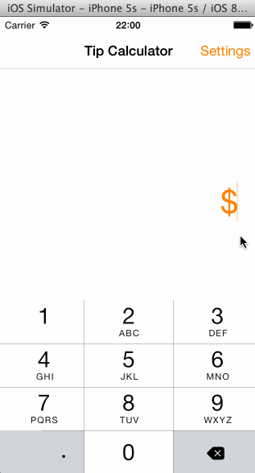

# TipCalulator

This is an iOS application to calculate tips

Time spent: 20 hours spent in total

Completed user stories:

 * [x] Required: All required tasks
 * [x] Optional: Animate the main view between a state when the bill amount is empty and another state when it's not empty.
 * [x] Optional: Remember the bill amount across app restarts. After an extended period of time, clear the state.
 * [x] Optional: Use locale specific currency and currency thousands separators.
 * [x] Optional: Add a light/dark color theme to the settings view. In viewWillAppear, update views with the correct theme colors.
 
Notes:

* I added a currency picker, which has the top currency (euro, yen...) at the top. The currency updates correctly both if the bill amount was empty or not
* The default tip is automatically sorted relatively to the other values: if the default tip is 15% the control will show: 10% | 15% | 20%, if the default tip is 25% the control will show: 10% | 20% | 25%
* The billAmountTextField shows formatted currency string when not in editing focus (will show '$2.00' when not editing). But when the user starts to edit, the cents get removed if they are equal to '.00' (will show '2' when editing)

* I created one helper (PrefsHelper) to deal with saving user defaults, notably with a tll
* I created one helper (ColorThemeHelper) to deal the app color theme
* I used one helper (NSDateAdditions) from Julien Quéré

* I struggled with changing the color theme. For some reason the textColor/tintColor would not be updated in the Setting page, so I picked two themes that had the same textColor/tintColor 
* I lost many, many hours struggling with bugs (impossible to animate UI elements) created because Auto Layout was on originally :(

Walkthrough of all user stories:

GIF created with [LiceCap](http://www.cockos.com/licecap/).
